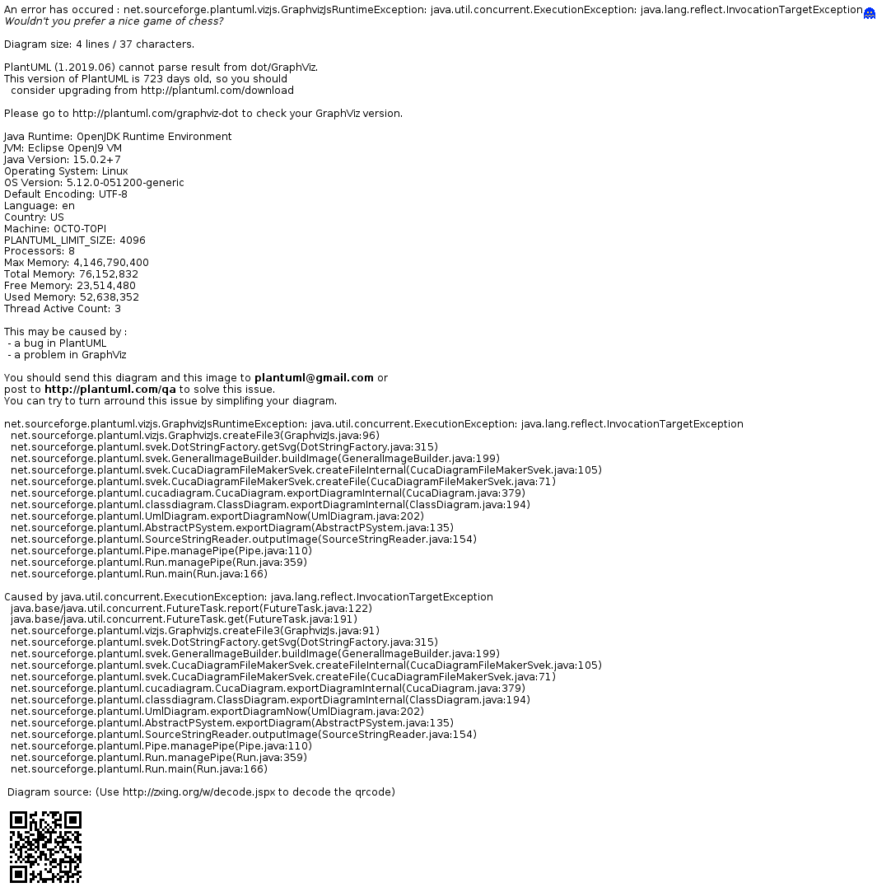

# Flakify

## TL,DR
This a proof-of-concept that some non-deterministic tests can be tracked down and
fixed using an automated method.

## What is a flaky test

Flaky test are non-deterministic false-positive tests.
False-positive tests are also called fragile because they break (fail) easily.
They are sometimes called flaky, as snowflake's ice crystals are extremely fragile.

There can be many causes for them, eg. :
- tests dependencies (tests depend upon some order to pass);
- dataset dependency (test depend upon some data to pass).

There is no official typology, even though there is [some publication](
http://mir.cs.illinois.edu/lamyaa/publications/fse14.pdf) on the subject.

Here we deal only with interaction between :
- implicit database row sorting;
- order-sensitive assertion.

Example (from [here](https://github.com/1024pix/pix/blob/dev/api/tests/integration/infrastructure/repositories/user-repository_test.js#L1054))
```javascript
     const expectedUsers = ['Son Gohan', 'Son Goku', 'Son Goten'];

     // SUT call
     const actualUsers = ['Son Goten', 'Son Gohan', 'Son Goku'];

     // order-sensitive test, will fail
     expect(map(actualUsers, 'firstName')).to.deep.equal(expectedUsers);

     // order-insensitive test
     expect(map(actualUsers, 'firstName')).to.have.members();
```

I do not imply order-insensitive assertions are the way to go.
The test's goal is to check your component (SUT) contract.
If the contract specify an order, you must use order-sensitive test.

## Make test less fragile

In order to make your test suite deterministic, you can:
- wait for your suite to fail, and fix the failing test;
- fix all potentially fragile tests now, in a preventive manner.

If you choose to act preventively, you'll have to check:
- each component contract;
- each assertion sensitivity.

This can be time-consuming in a large codebase.
Furthermore, this wouldn't prevent fragile test to be introduced afterwards.

You'll find here a way to artificially make fragile test to be even more fragile.
This way, you can track down which test should be fixed.

## Implementation

### TL;DR.
In a few words:
- a shuffled SQL view is created for each table (`ORDER BY random()`);
- each SQL `SELECT` query issued by knex query-builder is rewritten on the fly to use the shuffled view
- the returned dataset cause fragile test to fail.

If SQL native query `knex.raw` is used, a [SQL parser](https://github.com/taozhi8833998/node-sql-parser) is leveraged to replace knex AST

### Details



## Use

Download [flakify.js](./code/flakify.js).

Add [node-sql-parser](https://github.com/taozhi8833998/node-sql-parser) dependency.

For each database table (base table), create the shuffled view.
```sql
CREATE VIEW foo_shuffled AS
SELECT * FROM foo ORDER BY RANDOM()
```

Add the base table name in [tables](./code/flakify.js)
```javascript
const tables = ['foo'];
```

Wrap your knex instance
```javascript
const { flakify } = require('./flakify');
flakify(knex);
```

Run you tests: the fragile one should fail.

Below some examples:
- [in the codebase unit test suite](./test/flakify_test.js);
- [in an external codebase test suite](https://github.com/1024pix/pix/commits/tech-flakify-users).

## Disclaimer

This code is not published as a npm package as it's a proof of concept.

Even though a fair amount of unity test has been written, I'm pretty sure:
- some queries that should be rewritten are not;
- some queries that should not be rewritten are.

Furthermore, the code itself :
- has no design;
- does not express intention;
-  has too many nested levels.
