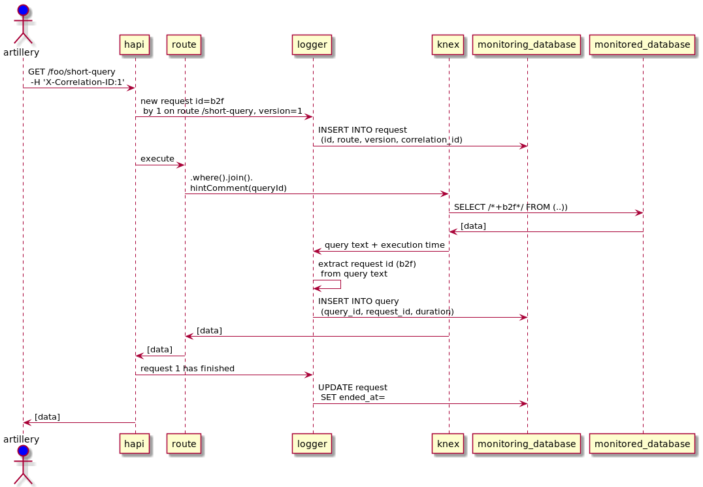
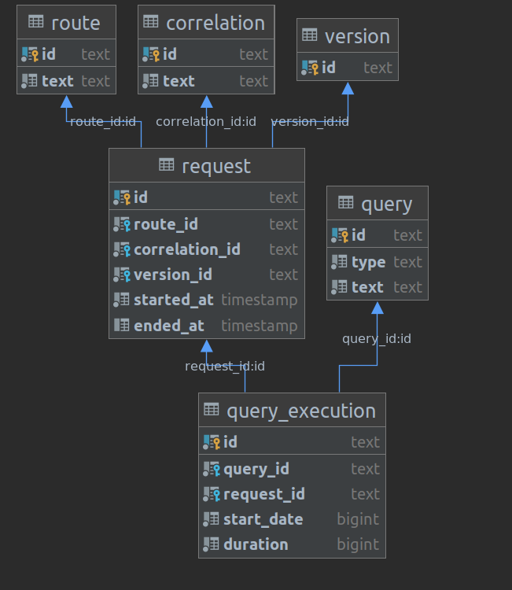

# Performance

Contents:
 * [TL;DR](#tldr)
 * [Goal](#goal)
 * [Implementation](#implementation)
 * [Usage](#usage)
 * [Disclaimer](#disclaimer)


## TLDR
A proof-of-concept that API performance test can be done on both:
- http request performance;
- database request performance.

Correlation is achieved by rewriting queries using knex library.
The solution works on limited knex query set (raw and `SELECT`),
but full query coverage, including Bookshelf ORM, can be achieved.

## Goal
Performance test are done in both sides:
- from client side (eg. in a performance test like Artillery);
- from database side (eg. using PostgreSQL native logs).

Correlation between http request and SQL query has to be done manually.

The aim is to track a user activity all the way.

Given an end-user (identified by a unique token):
- how many requests did he make ?
- how much time did they last ?
- how many database queries have been triggered, how long where they ?

Furthermore, we need global statistics:
- most running queries, shortest and longest;
- most called routes, shortest and longest;
- ability to partition by application version.

## Implementation

### Persistence
To make data manipulation easiest, all monitoring is stored in a database.
To ensure the logging itself does not affect the main database, it is logged
in a separate instance. Aggregated statistics are available through views.

### Timing queries
Knex emits events upon query creation and completion, which make query
timing easy, see [this tutorial](https://spin.atomicobject.com/2017/03/27/timing-queries-knexjs-nodejs/).

### Correlation http requests with queries
When some route handler issue a query with knex, knex has no idea which handler called him.
Google's [commenter](https://github.com/google/sqlcommenter/blob/master/nodejs/sqlcommenter-nodejs/)
hinted me to wrap trace data (here, http request) in SQL comment, which are not interpreted.

Knex does not yet offer [comments on any query](https://github.com/knex/knex/pull/2815),
but he supports [hints comments](http://knexjs.org/#Builder-hintComment) on a set.

### Logging request-specific data
Hapi provides hooks, which has been used to log requests:
- when a request has been received;
- before the response is sent.

The routing table is logged on startup, to provide an aggregated view on all requests.

The application version is read from `package.json` and logged in each request.

Each user is identified by a custom `X-CorrelationId` header logged with each request.

### Overview


## Usage

### Overview
The logger itself use two components:
- HTTP request logging : [request.js](./code/request.js)
- queries logging : [knexHandlers.js](./code/knexHandlers.js)

They have been plugged in a sample API and cannot be used out-of-the-box.

### Sample API
It offers some `CRUD` routes.
```
method  path              description
------  ----------------  ----------------------------------
POST    /foo              Insert data (according to payload)
DELETE  /foo              Remove all data
GET     /foo/long-query   Execute a SELECT query (long)
GET     /foo/short-query  Execute a SELECT query (brief)
PUT     /version          Deploy a new version
```
Note: The `/version` is used to fake a deployment

### Activity
Actual activity is simulated using the load test tool [Artillery](https://artillery.io/).

The tests scenarios are the following:
- insert a few some data and issue some simple `SELECT` queries
- deploy a new version and issue the same queries as before
- insert more date issue some simple `SELECT` queries
- insert a lot of data and issue long-running `SELECT` queries (timeout included)

The version deployment cause the following:
- speed up of SQL queries, by creating an index;
- slow down of the API itself, by faking a long calculation ( with setTimeout).

### Setup
Retrieve the repository locally.

Create `.env` file using `sample.env`.

### Create some activity
Start the database and start the API: `npm start`.
In another shell, launch the load test: `npm test`.

### Get results
When the tests are finished, check the following views.

##### Aggregated results

##### `query_statistics`
All queries

| query\_source | count | first\_executed | last\_executed | min\_duration\_ms | max\_duration\_ms | average\_duration\_ms | standard\_deviation\_ms |
| :--- | :--- | :--- | :--- | :--- | :--- | :--- | :--- |
| CREATE INDEX on foo\(id\); | 1 | 06:48:04 | 06:48:04 | 7 | 7 | 7 | 0 |
| INSERT INTO foo \(id\) SELECT floor\(random\(\) \* 100 + | 596 | 06:47:51 | 06:48:16 | 1 | 12 | 2 | 1 |
| SELECT id, COUNT\(1\) FROM foo GROUP BY id | 902 | 06:47:51 | 06:48:29 | 0 | 29 | 4 | 4 |
| TRUNCATE TABLE foo | 4 | 06:47:50 | 06:48:30 | 2 | 6 | 4 | 1 |
| select  \* from "foo" limit $1 | 902 | 06:47:51 | 06:48:29 | 0 | 10 | 0 | 1 |

##### `query_version_statistics`
All queries, grouped by version (to track down SQL queries issues caused by deployment)

| query\_source | version\_no | count | first\_executed | last\_executed | min\_duration | max\_duration | average\_duration | standard\_deviation |
| :--- | :--- | :--- | :--- | :--- | :--- | :--- | :--- | :--- |
| CREATE INDEX on foo\(id\); | 1.0.0 | 1 | 06:48:04 | 06:48:04 | 7 | 7 | 7 | 0 |
| INSERT INTO foo \(id\) SELECT floor\(random\(\) \* 100 + 1\)::int FROM generate\_series\( 1, 10\) | 1.0.0 | 304 | 06:47:51 | 06:48:02 | 1 | 12 | 2 | 1 |
| SELECT id, COUNT\(1\) FROM foo GROUP BY id | 1.0.0 | 304 | 06:47:51 | 06:48:02 | 0 | 12 | 1 | 1 |
| TRUNCATE TABLE foo | 1.0.0 | 2 | 06:47:50 | 06:48:04 | 2 | 3 | 2 | 0 |
| select  \* from "foo" limit $1 | 1.1.1 | 598 | 06:48:04 | 06:48:29 | 0 | 8 | 0 | 0 |

##### `route_version_statistics`
All routes, grouped by version (to track down API issues caused by deployment)

| route | version\_no | min | max | average |
| :--- | :--- | :--- | :--- | :--- |
| delete /foo | 1.0.0 | 8 | 13 | 10 |
| delete /foo | 1.1.1 | 11 | 11 | 11 |
| get /foo/long-query | 1.1.1 | 3037 | 3037 | 3037 |
| get /foo/short-query | 1.0.0 | 4 | 31 | 8 |
| get /foo/short-query | 1.1.1 | 104 | 138 | 112 |
| post /foo | 1.0.0 | 4 | 38 | 9 |
| post /foo | 1.1.1 | 4 | 310 | 9 |
| put /version | 1.0.0 | 11 | 11 | 11 |

##### Raw results

You can browse the base tables:
- `correlation`
- `route`
- `version`
- `request`
- `query`
- `query_execution`



## Disclaimer

This code is not published as a npm package as it's a proof of concept.
It has no automated test and cannot be used out-of-the box.
